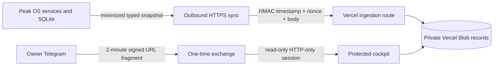

# Peak OS Executive Dashboard

## Architecture and privacy boundary

The dashboard is an owner-only, read-only view. LINE101Chat never opens the live Peak OS
SQLite database and the Windows host does not expose an inbound port.



The snapshot contains only the fields defined in `src/lib/peak/types.ts`. It contains no local
paths, database rows, secrets, Telegram identifiers, health notes, bucket names, stack traces,
or credentials. Unknown data remains `null`. The public site and sitemap never read the snapshot.

## Authentication

Normal cockpit access uses:

- the existing private Telegram owner-ID authorization boundary;
- `/peak_login`, which creates a two-minute purpose- and audience-bound bearer;
- a dedicated login secret that is not reused for synchronization or sessions;
- a URL fragment removed before the browser contacts the exchange API;
- durable single-use nonce consumption in private Vercel Blob; and
- a read-only `cockpit` session that cannot change the password.

Emergency administrative access retains:

- an allowlisted email;
- a PBKDF2-SHA512 bootstrap verifier in Vercel environment configuration;
- a durable owner verifier in private Vercel Blob after one-time initialization;
- an HMAC-signed, eight-hour, HTTP-only, `SameSite=Strict`, production-`Secure` cookie;
- same-origin validation for POST operations; and
- failed-login rate limiting backed by private Vercel Blob in production.

The durable record is authoritative once present. An absent record uses the environment verifier
only for bootstrap. A corrupt or unreadable durable record fails closed and does not fall back.
Password changes perform a private-store read-after-write check before reporting success.

Generate the password verifier without placing the password on the command line:

```powershell
cd C:\line101chat-site
.\scripts\New-PeakDashboardPasswordHash.ps1
```

Generate independent 32-byte secrets for the session and synchronization credentials. Store
them in Vercel, never in Git or browser-prefixed variables. Generate a third independent login
secret shared only by Peak OS and Vercel.

## Website configuration

```dotenv
PEAK_DASHBOARD_ENABLED=true
PEAK_DASHBOARD_OWNER_EMAILS=owner@example.com
PEAK_DASHBOARD_PASSWORD_HASH=pbkdf2-sha512$310000$...
PEAK_DASHBOARD_SESSION_SECRET=<independent-random-secret>
PEAK_DASHBOARD_LOGIN_SECRET=<independent-random-secret-shared-with-Peak-OS>
PEAK_DASHBOARD_SYNC_SECRET=<independent-random-secret-shared-with-Peak-OS>
PEAK_DASHBOARD_STALE_AFTER_MINUTES=30
```

Connect a **private Vercel Blob** store to the project. Vercel supplies the
`BLOB_READ_WRITE_TOKEN`, or short-lived OIDC credentials with a store ID, directly to the
deployment. Do not copy those values into source files or ordinary local configuration.

Production fails closed if durable private storage is missing. Dashboard snapshots, replay-window
state, and rate-limit state use private objects and are never delivered directly to browsers.

Create and connect the store from the linked project:

```powershell
npx --yes vercel@latest blob create-store peak-os-private --access private --region sin1 --yes
```

The password itself may be retained in the owner's DPAPI-protected local credential for local
operator tooling. It is not a website authentication source. To create the bootstrap verifier run:

```powershell
.\scripts\Set-PeakDashboardPassword.ps1
```

Deploy after changing a Vercel environment verifier. Then initialize the durable verifier once,
without printing or transmitting plaintext:

```powershell
.\scripts\Initialize-PeakDashboardPassword.ps1
```

Subsequent password changes use the authenticated `/peak/password` page or the trusted local
`scripts/Set-PeakDashboardPassword.ps1` recovery tool. Both update the durable server verifier and survive logout,
serverless cold starts, and deployments because the verified hash is stored in private Blob.

## Routes

- `GET /peak/login` — Telegram-first instructions and collapsed emergency password form
- `GET /peak/access` — fragment-consuming one-time Telegram access page
- `GET /peak` — protected, dynamically rendered dashboard
- `GET /peak-os` — protected Executive State 1.0 cockpit
- `POST /api/peak/v1/telegram-login` — single-use read-only cockpit session exchange
- `POST /api/peak/v1/login` and `/logout` — session lifecycle
- `POST /api/peak/v1/snapshot` — signed Peak OS ingestion only
- `POST` and owner-session `GET /api/peak/v1/executive-state` — signed state ingestion and LKG read
- `GET /api/peak/v1/health` — owner-session health/freshness metadata
- `GET /api/peak/v1/summary` — owner-session-protected read response

All protected responses use `private, no-store` and `noindex, nofollow, noarchive`. `/peak` and
`/api/peak` are disallowed in `robots.txt` and absent from `sitemap.xml`. URL secrecy is not an
authorization mechanism.

## Data definitions and freshness

Peak OS remains the source of truth. Health status uses its deterministic policy and provenance.
The frontend never recomputes sustainability. `unknown` is rendered as `未知/無資料`, never zero.
The website separately marks the entire snapshot stale when its receipt age exceeds the configured
threshold. Offline state preserves the last synchronization time when available.

Backup is `已驗證復原` only after local encryption, cloud-object verification, successful
download/decryption, manifest verification, SQLite integrity, and Peak OS smoke verification.

## Local verification

```powershell
cd C:\line101chat-site
npm install
npm run lint
npm test
npm run build
```

For local-only testing, configure the variables in `.env.local`. Do not use synthetic data in
production and do not commit `.env.local`.

## Deployment and first login

1. Connect a private Vercel Blob store and configure the website variables in Vercel.
2. Deploy the website and verify that unauthenticated `/peak` redirects to `/peak/login`.
3. Configure the same independent login secret in Vercel and Peak OS; configure the matching
   synchronization secret and Vercel snapshot URL separately.
4. Enable Peak OS outbound synchronization and restart the resident worker.
5. Send `/peak_login` in the owner's private Telegram chat, tap the button, and confirm the
   read-only cockpit opens. A second exchange of the same token must be rejected.
6. Confirm a snapshot has been accepted.
7. Confirm unknown, stale, backup, and sustainability labels before relying on the view.

Do not claim live deployment until the protected production route and signed synchronization have
been exercised. The current implementation does not include write operations.

## Secret rotation and access removal

Rotate the login or synchronization secret in both systems during one maintenance window. Rotate
the session secret to invalidate every browser session. Change the password hash to revoke the old
password. Remove an email from the allowlist to remove owner access. Set
`PEAK_DASHBOARD_ENABLED=false` and redeploy to disable all dashboard routes.

## Incident response

If unauthorized access is suspected: disable the dashboard, rotate session/login/sync credentials,
inspect coarse Vercel authentication/synchronization events, clear the private snapshot record,
and redeploy. Logs intentionally contain event names rather than health values, reflections,
email addresses, project text, or request bodies.

## Rollback

Disable `PEAK_DASHBOARD_ENABLED` in Vercel and `PEAK_DASHBOARD_SYNC_ENABLED` in Peak OS, redeploy
the site, and restart the worker. This stops access and outbound transfer without modifying Peak OS
SQLite. Code rollback can then remove `/peak`, `/api/peak`, `src/lib/peak`, and the corresponding
Next.js headers/robots entries.

## Deferred work

Secure writes, phone ingestion, financial data, detailed relationship information, reflection
pagination, a public synthetic case study, bilingual dashboard content, and passkeys/OAuth are
deliberately deferred.
