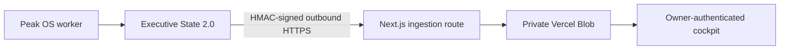

# Private Peak OS Executive Cockpit

## Data flow and boundary



The website receives only the fields in `src/lib/peak/executive-types.ts`. It does not receive
local paths, arbitrary database fields, Telegram identifiers, credentials, private notes, or
source documents. `src/lib/peak/executive-validation.ts` rejects unsupported versions, unknown
fields, unbounded collections, invalid timestamps, and malformed hashes before storage.

The browser never receives the synchronization secret or Blob credentials. The worker initiates
all data transfer over HTTPS; the PC exposes no inbound service.

## Server-only configuration

```dotenv
PEAK_DASHBOARD_ENABLED=true
PEAK_DASHBOARD_OWNER_EMAILS=owner@example.com
PEAK_DASHBOARD_PASSWORD_HASH=pbkdf2-sha512$310000$...
PEAK_DASHBOARD_SESSION_SECRET=<at-least-32-random-characters>
PEAK_DASHBOARD_LOGIN_SECRET=<different-at-least-32-character-secret>
PEAK_DASHBOARD_SYNC_SECRET=<different-at-least-32-character-secret>
PEAK_DASHBOARD_STALE_AFTER_MINUTES=30
```

Vercel must connect a private Blob store and provide its managed server-side credentials. No
variable may use a `NEXT_PUBLIC_` prefix. The worker and website share only the login secret for
Telegram access links and the synchronization secret for state uploads; these must remain
distinct from the session secret.

The private data record is `peak/executive/v2/latest.json`. Password, replay-window, and rate-limit
objects remain under `peak/security/` and are separate from cockpit data.

## Routes

- `GET /peak-os` — protected, dynamically rendered Executive State 2.0 cockpit
- `GET /peak` — redirect to `/peak-os`
- `GET /peak/login` — Telegram-first instructions and collapsed password fallback
- `GET /peak/access` — consumes a one-time Telegram token from the URL fragment
- `GET /peak/password` — admin-session password management
- `POST` and authenticated `GET /api/peak/v1/executive-state` — signed ingestion and read-back
- `POST /api/peak/v1/telegram-login` — one-time read-only cockpit session exchange
- `POST /api/peak/v1/login`, `/logout`, and `/password` — administrative session lifecycle

Protected responses are private and non-cacheable, and the entire route family is excluded from
the public sitemap and disallowed in `robots.txt`.

## Authentication

The normal workflow starts with `/peak_login` in the authorized owner's private Telegram chat.
The returned two-minute token is single-use and held only in the URL fragment until the access
page submits it. It creates a read-only `cockpit` session. Password and trusted local login create
an `admin` session for emergency administration.

Sessions are signed, time-bounded, owner-allowlisted, `Secure`, HTTP-only, and `SameSite=Strict` in
production. State-changing browser requests require same-origin metadata. Replay and rate-limit
state is durable, so a process restart does not make a used token reusable.

## Deployment and migration

Build and test the exact release commit:

```powershell
npm ci
npm run lint
npm test
npm run build
```

Deploy the website before the worker begins sending Executive State 2.0. Preserve the existing
private Blob binding and all server-only secrets. No new environment variable is required for the
2.0 contract.

After deployment, verify:

1. unauthenticated page and API boundaries;
2. one successful Telegram login and rejection of replay;
3. signed 2.0 ingestion and authenticated read-back;
4. rejection of schema 1.0 and extra-field payloads without replacing last-known-good state;
5. Portfolio Chief and four domain cards on `/peak-os`;
6. `/peak` redirection, logout, and emergency password login.

If ingestion fails, leave the worker's retry loop bounded and inspect only coarse server logs.
Never log request bodies, tokens, secrets, or private Blob contents.

## Disable and rollback

Set `PEAK_DASHBOARD_ENABLED=false` and redeploy to make the page and APIs unavailable. Disable the
worker's outbound dashboard synchronization separately. A code rollback must not restore retired
data objects or compatibility endpoints; roll forward with a corrected 2.0 build instead.
